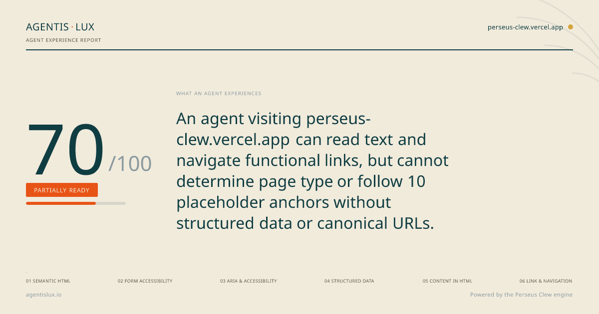
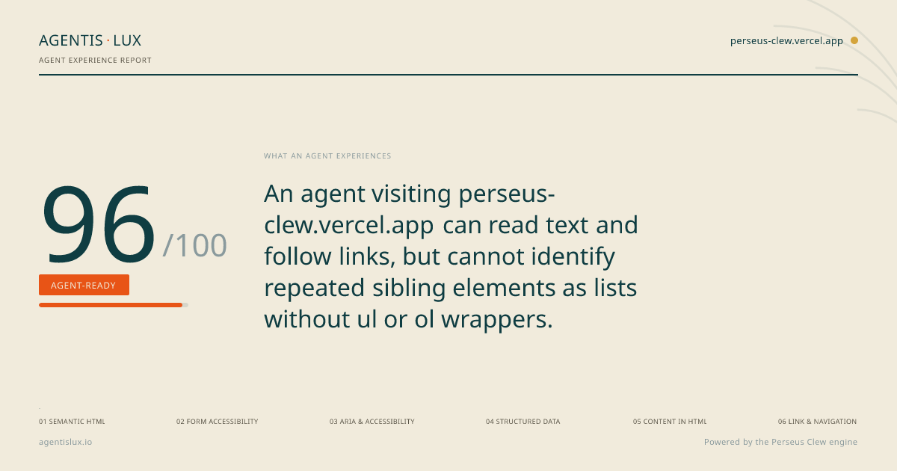
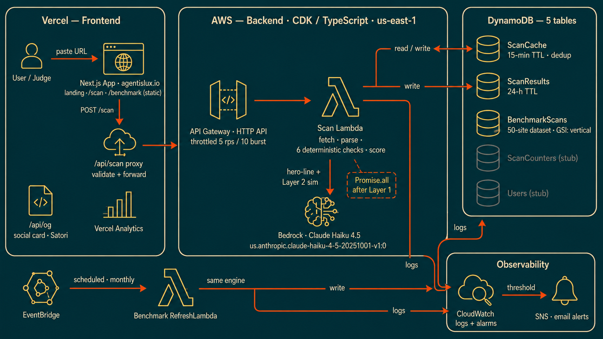

# Agentis Lux

**See what AI agents experience on your site.**
For your second audience.

Engine: Perseus Clew, part of the Clew suite. Public name: Agentis Lux. Domain: agentislux.io.

> ### Status: Live
> The scan engine is live and usable at [agentislux.io](https://agentislux.io).

## What this is

The web has a second audience now: AI retrieval agents. When someone asks ChatGPT, Perplexity, or Google AI Overviews a question, a retrieval agent fetches your page and reads its raw HTML to answer, before any JavaScript runs, not the rendered version a person sees. That is a different reader than the human you designed for, and most products were never tested for it. Agentis Lux scans a site and surfaces what that agent experiences when it tries to read and use it.

Agentis Lux scans a site and surfaces what an agent experiences when it tries to use it. It reports findings from the agent's point of view, like "an agent landing on this page can't tell which element starts checkout, because it's a styled div and not a button." It describes what the agent can and can't do. It does not suggest fixes, because fixes assume knowledge of your codebase. Awareness, not judgment.

Built for the H0 Hackathon, B2B track.

## On the landscape (because I did my homework)

Agentis Lux reads what an AI retrieval agent reads: your raw HTML, before any JavaScript runs, the way ChatGPT, Perplexity, and AI Overviews pull a page. It scores six categories of that experience and simulates an agent attempting tasks. That is its lane: agent operability on the retrieval surface.

It is not alone in caring about agents, and it is worth being clear about who does what:

- Scrunch (acquired by Sitecore) works on AI search visibility: whether your brand gets cited when someone asks an AI a question. That is about being found. Agentis Lux is about whether an agent can actually read and use what it finds. Visibility, not operability.
- Google's experimental Agentic Browsing audit in Lighthouse (shipped May 2026) checks the agent-as-actor surface: WebMCP tool registration and whether a browser-driving agent can operate your page. Agentis Lux goes deeper on the agent-as-reader surface: the raw HTML a retrieval agent forms an impression from before it ever acts. Different door.

The agentic web is new enough that Google only added experimental, unscored agent-readiness checks two months ago. That is not a reason this is unoriginal. It is evidence the problem is real and the lane is open. Agentis Lux is the transparent, findings-only, developer-facing diagnostic for the reading surface, with the API scan as a second axis nobody in the visibility crowd touches.

## On timeline and provenance

Agentis Lux (engine: Perseus Clew) was built during the hackathon window. The idea has older roots. It grew out of Hermes Clew, an agent-readiness scanner built for the GitLab AI hackathon earlier in 2026, and the thinking has developed since. What is new and built in-window is this product: the unified scanner, the AWS engine, the 50-site benchmark, and everything in this repo. Earlier dates in design notes reflect when the idea was being thought through, not when the product was built.

## What works today, and what's pending

Built and merged:

- Six frontend checks (semantic HTML, form accessibility, ARIA, structured data, content in HTML, link and navigation), all implemented with cheerio.
- Six API checks (naming and descriptions, error design, discoverability, response efficiency, reliability patterns, agent integration), derived in part from Emmanuel Paraskakis's API checklist. See NOTICE.
- Two scoring modules computing weighted scores, with ratings of Agent-Ready, Partially Ready, or Not Yet Readable.
- An agent-simulation layer that calls AWS Bedrock (Claude Haiku) for a plain-language verdict, fail-soft if Bedrock is unavailable.
- A benchmark batch engine that scans 50 curated sites, ten per vertical, and writes results to DynamoDB.
- Full CI: lint, type-check, and the test suites run on every push and pull request.

Pending:

- Input types. The public scan reads a URL today. Repo scanning and spec upload are gated as "Team tier" in the UI.

## Known limitations and tradeoffs

See [KNOWN-LIMITATIONS.md](docs/KNOWN-LIMITATIONS.md) for the deliberate decisions and deferred work. Tradeoffs include using JavaScript rather than TypeScript for the backend Lambda handlers, using in-memory container rate limiting instead of a full WAF-level configuration for the public demo, and serving a static snapshot of the 50-site benchmark rather than running live DynamoDB queries.

Roadmap: where AgentisLux is going, in the open — see [docs/ROADMAP.md](docs/ROADMAP.md)

## The bet

Before the engine scans anything, I wrote down what I expect it to find across the 50 sites, and committed it with a timestamp. Predictions first, data later. Read them in [docs/BENCHMARK-HYPOTHESES.md](docs/BENCHMARK-HYPOTHESES.md). The site list and the selection rationale are in [docs/BENCHMARK-SITES.md](docs/BENCHMARK-SITES.md).

## Dogfooding

We scan our own site and publish the result, flattering or not.

**Before** (score 70, before any cleanup):



**After** (score 96, after fixing what the tool found):



The gaps were in structured data (3/15 to 15/15), form accessibility, ARIA, and link navigation. One finding remains (SEM-005), shown honestly. The complete before/after story is in [docs/self-scan/](docs/self-scan/).

Full artifacts:
- [Before: scan JSON](docs/self-scan/before/self-scan-before.json) | [report](docs/self-scan/before/self-scan-before-report.html)
- [After: report](docs/self-scan/after/self-scan-after-report.html) | [writeup](docs/self-scan/SELF-SCAN-AFTER.md)
- [Build-in-public writeup (before)](docs/self-scan/SELF-SCAN-BEFORE.md)

### Does it pass its own bar?

A scanner that tells you what agents and assistive tech experience should hold up when you run the same tools on it. So here is the landing page, measured on Google PageSpeed Insights (Lighthouse), June 23, 2026:

| Category | Score |
| :--- | :--- |
| Performance | 100 |
| Accessibility | 95 |
| Best Practices | 100 |
| SEO | 100 |
| Agentic Browsing (experimental) | 2 / 2 |

The last row is the one I care about most. Google's experimental "Agentic Browsing" category checks whether a site is well-formed for AI agents, the exact thing AgentisLux measures. The landing page passes both of its audits.

Run it yourself: https://pagespeed.web.dev/analysis?url=https://agentislux.io

Two notes. This measures the landing page, not the post-scan results view, which has its own heading-hierarchy work left to do. And the 95, not 100, on accessibility is real: some of the small uppercase label text in the design does not meet contrast thresholds yet. Both are tracked, not hidden.

## Benchmark

I scanned 50 sites to see what agents experience across the web: ten each in e-commerce, SaaS, content/media, US government, and indie/builder projects. The headline: indie builders scored highest (mean 77/100), beating government, SaaS, and e-commerce. Scores ran from 34 to 91, with no convergence on agent-readiness yet. Four sites blocked the scan at the door, including OpenAI. The complete dataset, every site, including the ones that blocked us, is in [docs/benchmark/](docs/benchmark/), and the predictions I made before scanning are timestamped in [docs/BENCHMARK-HYPOTHESES.md](docs/BENCHMARK-HYPOTHESES.md). I missed three of six, which is the point.

## Architecture



Frontend on Vercel, backend on AWS Lambda + Bedrock, data in DynamoDB. The live scan path touches only ScanCache and ScanResults; the benchmark refresh runs on a separate schedule.

Two ideas run through the whole build. The structure is deterministic, so the same input gives the same score every time. The flavor is AI, used only where judgment helps. The checks and the scoring are pattern matching, no model involved. Bedrock writes the one-line verdict and runs the agent simulation on top of that.

Stack:

- **Backend:** Node ESM Lambda source. Six frontend checks, six API checks, two scoring modules, two scan flows (one for frontend HTML, one for API specs), a scan handler, the simulation layer, and the benchmark engine.
- **Frontend:** Next.js (App Router) with an `/api/scan` proxy route.
- **Infra:** AWS CDK in TypeScript, four stacks (base, data, compute, monitoring).
- **Containers:** Docker. The Lambdas run as container images, and the stack runs locally with Docker Compose.

AWS services defined in the CDK stack:

- **Lambda** (Docker image): the scan function, and a monthly benchmark-refresh function.
- **API Gateway** (HTTP API): `POST /scan` and `GET /health`, CORS locked to agentislux.io.
- **Bedrock:** Claude Haiku, called by the scan Lambda for the verdict and the simulation.
- **DynamoDB:** five tables, for benchmark scans, scan counters, ephemeral results, a short-lived URL cache, and users.
- **EventBridge:** a monthly rule to refresh the benchmark dataset.
- **CloudWatch and SNS:** alarms on scan error rate and duration, wired to an alert topic.

Everything above is defined in the stack and verified by a type-checking build in CI.

## Project structure

```
perseus-clew/
├── backend/                  Node ESM Lambda source
│   ├── src/
│   │   ├── checks/           the six frontend checks and six API checks
│   │   ├── scoring/          weighted scoring
│   │   ├── orchestrator/     scan flows and the agent simulation
│   │   ├── handlers/         Lambda entry points (scan, refresh)
│   │   ├── benchmark/        the 50-site batch engine and site list
│   │   ├── shared/           fetch, parse, sanitize, Bedrock client
│   │   └── simulation/
│   ├── scripts/              local DB init, local server, run-benchmark CLI
│   └── tests/                Vitest suites (unit, integration, fixtures)
├── frontend/                 Next.js App Router app
│   ├── app/                  routes, including the /api/scan proxy and /scan
│   ├── components/           landing, shell, common, ResultHero
│   ├── lib/                  report export
│   ├── styles/               tokens and globals
│   └── tests/                Vitest suites
├── infra/                    AWS CDK (TypeScript)
│   ├── bin/app.ts
│   └── lib/                  base, data, compute, monitoring stacks
├── docs/                     source-of-truth specs and methodology
│   ├── ARCHITECTURE.md
│   ├── SCORING.md
│   ├── BACKEND-FRONTEND-CHECKS.md
│   ├── BACKEND-API-CHECKS.md
│   ├── BACKEND-SHARED.md
│   ├── FRONTEND-SPEC.md
│   ├── BENCHMARK-HYPOTHESES.md      the pre-registered predictions
│   ├── BENCHMARK-SITES.md           the 50 sites and selection rationale
│   ├── KNOWN-LIMITATIONS.md         design and architectural tradeoffs
│   └── benchmark-candidate-pool.md
├── mockups/                  locked visual design (landing, app, verdict hero)
├── .kiro/                    steering file and enforcement hooks
├── .github/workflows/        ci.yml, deploy-aws.yml, self-scan.yml
├── Dockerfile, Dockerfile.dev, docker-compose.yml
├── NOTICE                    attribution for Paraskakis and the Clew suite
└── README.md
```

## Running it locally

This is the way to run the engine locally for development. The test suites exercise every check against fixtures. There is also a live hosted scan available at [agentislux.io](https://agentislux.io).

```
nvm use            # Node version from .nvmrc
npm ci             # install
npm test           # run the Vitest suites
```

Docker Compose runs the stack locally for development:

```
docker compose up
```

The scan runs in the tests locally, behind the API, and on the live hosted scanner at [agentislux.io](https://agentislux.io).

## Methodology and docs

The scoring methodology is published and versioned, so anyone can audit it.

- [docs/SCORING.md](docs/SCORING.md): categories, weights, and what each check looks for.
- [docs/ARCHITECTURE.md](docs/ARCHITECTURE.md): system design.
- [docs/BACKEND-FRONTEND-CHECKS.md](docs/BACKEND-FRONTEND-CHECKS.md) and [docs/BACKEND-API-CHECKS.md](docs/BACKEND-API-CHECKS.md): the check definitions.
- [docs/BENCHMARK-HYPOTHESES.md](docs/BENCHMARK-HYPOTHESES.md): the pre-registered predictions.
- [docs/BENCHMARK-SITES.md](docs/BENCHMARK-SITES.md): the 50 sites and why each one is in.

The API checks draw in part on the "Build AI-Ready Products" API checklist by Emmanuel Paraskakis, credited in NOTICE.

## License

Apache 2.0. Use it, change it, share it, say where it came from. See LICENSE.

---

*AI assisted. Human approved. Powered by NLP.*
